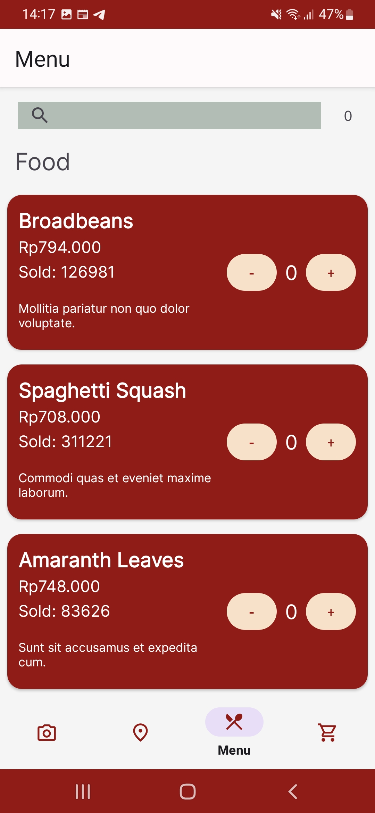
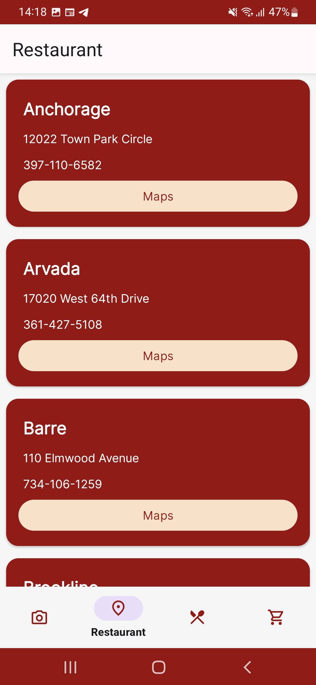
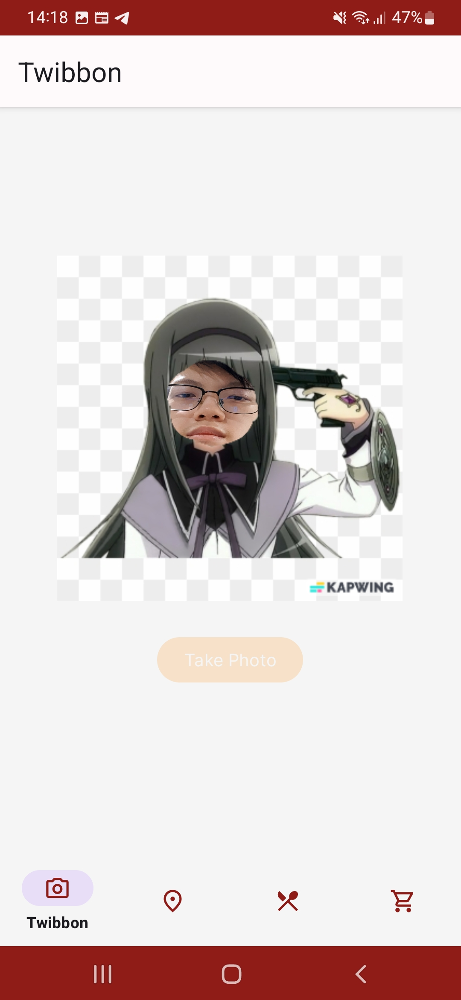

# IF3210-2023-Android-DBA

Majika adalah aplikasi restoran makanan berbasis Android. 
Aplikasi ini menyediakan daftar menu yang dimiliki oleh restoran, 
sekaligus pemesanan menu dan melakukan pembayaran dengan QR code. 
Pengguna tidak akan kesusahan untuk mencari lokasi restoran, 
karena pengguna dapat melihat daftar cabang restoran yang tersedia. 
Di sisi lain, pengguna juga dapat melakukan foto twibbon di aplikasi ini pula.

## External Libraries
- [Retrofit](https://square.github.io/retrofit/)
- [Gson](https://github.com/google/gson)
- [Code Scanner](https://github.com/yuriy-budiyev/code-scanner)

## Screenshots
#### Splash Screen

#### Menu

 
 

 
 

#### Restaurants

#### Twibbon

#### Cart

#### Payment

 
 

## Team Members
<table>
  <tr>
    <th>NIM</th>
    <th>Nama</th>
    <th>Tugas</th>
    <th>Waktu Dedikasi</th>
  </tr>
  <tr>
    <td>13520029</td>
    <td>Muhammad Garebaldhie Er Rahman</td>
    <td>
      - Keranjang 
      - Pembayaran
    </td>
    <td>25 jam</td>
  </tr>
  <tr>
    <td>13520071</td>
    <td>Wesly Giovano</td>
    <td>
      - Daftar restoran 
      - Pembayaran
    </td>
    <td>25 jam</td>
  </tr>
  <tr>
    <td>13520163</td>
    <td>Frederik Imanuel Louis</td>
    <td>
        - Header dan navbar 
        - Daftar menu 
        - Twibbon
    </td>
    <td>40 jam</td>
  </tr>
</table>
